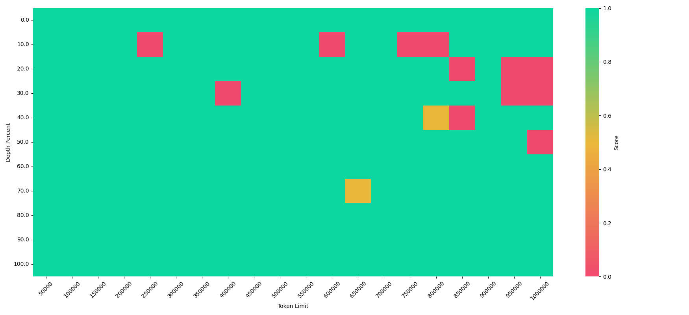
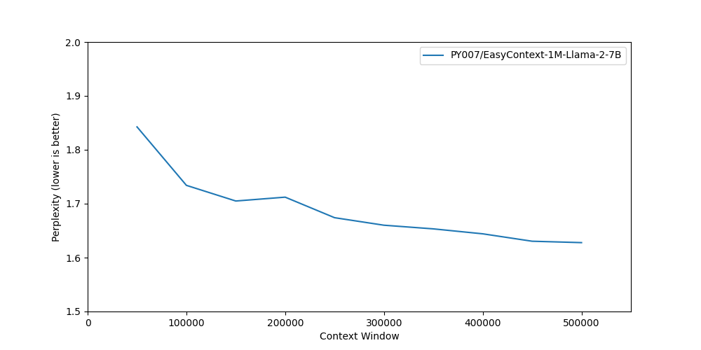

# EasyContext

<p align="center">
  
</p>

<p align="center">
    🤗 <a href="https://huggingface.co/collections/PY007/easycontext-660cef5a02b514836996b782" target="_blank">Hugging Face</a>
</p>

Memory optimization and training recipes to extrapolate language models' context length to 1 million tokens, with minimal hardware.


## What is this?

Many companies have been promoting their models' capability to handle long context. For those outside the companies, a context of 1 million tokens still seems somewhat magical or requires enormous compute.  **This repo aims to demystify long context scaling and show that it is actually quite straightforward.**
 
This repo does not propose new ideas. Instead, we showcase how to combine existing techniques to train language models with a context length of:

- **700K with 8 A100 (Llama2-7B)**.
- **1M with 16 A100 (Llama2-13B)**.

No approximations are used. The models can be trained with **full finetuning, full attention, and full sequence length**. Our training script (train.py) has less than 200 lines of code.

The techniques used are:

- Sequence parallelism.

- [Deepspeed zero3 offload](https://www.deepspeed.ai/2021/03/07/zero3-offload.html).

- [Flash attention](https://github.com/Dao-AILab/flash-attention) and its fused cross entropy kernel.

- Activation checkpointing.

We support different sequence parallel methods:

- Ring attention ([Shenggui et al.](https://aclanthology.org/2023.acl-long.134/);[Liu et al.](https://arxiv.org/abs/2310.01889), and specifically Zilin's [implementation](https://github.com/zhuzilin/ring-flash-attention))
- Dist flash attention (previously called LightSeq. [Li et al.](https://arxiv.org/html/2310.03294v2))
- Deepspeed Ulysses ([Jacobs et al.](https://arxiv.org/abs/2309.14509) and Jiarui's [implementation](https://github.com/feifeibear/long-context-attention))

We then proceed to train Llama-2-7B on 8 A100 by gradually increasing its rope base frequency to 1B. Notably, our model is only trained with 512K sequence length while generalizing to nearly 1M context.

## Updates
- [05/11] Add Ulysses.
- [05/06] Add distractors (multi-needle) in the NIAH evaluation script. You can set the number of distractors using --num_distractor.
- [05/06] IMPORTANT! If you want to use eval_needle.py to evaluate the llama3 model, you need to add one extra space (" ") behind the QUESTION_STR. I believe this has something to do with the tokenizer. 
## Usage

```python
from easy_context import prepare_seq_parallel_inputs, apply_seq_parallel_monkey_patch, prepare_dataloader
from transformers import LlamaForCausalLM
# Swap attention implementation from flash attn to either dist_ring_attn or zigzag_ring_attn
apply_seq_parallel_monkey_patch("dist_flash_attn", "llama")
# Make sure you toggle on flash_attention_2
model = LlamaForCausalLM.from_pretrained(model_name, _attn_implementation="flash_attention_2")
accelerator = ...
train_dataloader = ...
prepare_dataloader("dist_flash_attn", train_dataloader, accelerator)

# In your training loop...
for step, batch in enumerate(train_dataloader):
  # Shard the sequences
  prepared = prepare_seq_parallel_inputs("dist_flash_attn", batch["input_ids"], batch["position_ids"], batch["target_ids"], accelerator.process_index, accelerator.num_processes, accelerator.device)
  local_input_ids = prepared["local_input_ids"]  
  local_position_ids = prepared["local_position_ids"]
  local_target_ids = prepared["local_target_ids"]
  # Then do model forward as usual
  logits = model(local_input_ids,position_ids=local_position_ids,).logits
```


## Results
#### Needle-in-a-haystack 

<p align="center">
  
</p>

There are still some red bricks. I am not sure if instruction tuning or heavier long-context training would help.

#### Perplexity

<p align="center">
  
</p>

It is tested on 2 documents with 500K to 600K length in the proofpile test set(the longest I can find).


## Installation
The code is tested on Python 3.10.0, PyTorch 2.4.0 (nightly), and CUDA 11.8.

```bash
conda create -n easycontext python=3.10 -y && conda activate easycontext
pip install --pre torch==2.4.0.dev20240324  --index-url https://download.pytorch.org/whl/nightly/cu118
pip install packaging &&  pip install ninja && pip install flash-attn --no-build-isolation --no-cache-dir
pip install -r requirements.txt
```

Note that PyTorch nightly is a must because I noticed that PyTorch 2.2.0 will OOM for 700K context length on 8 A100s.


## Evaluation

#### Needle-in-a-haystack 
```python
accelerate launch --num_processes 8 --config_file  accelerate_configs/deepspeed_inference.yaml  --main_process_port 6000 eval_needle.py \
    --model PY007/EasyContext-1M-Llama-2-7B  \
    --max_context_length 1000000 \
    --min_context_length 50000 \
    --context_interval   50000 \
    --depth_interval 0.1 \
    --num_samples 2 \
    --rnd_number_digits 7 \
    --haystack_dir PaulGrahamEssays 
```
The above command takes around 6 hours. To reduce time, consider increasing the context_interval and depth_interval.

#### Perplexity
There are only two documents in proofpile test with length longer than 500K.

```python
accelerate launch --config_file  accelerate_configs/deepspeed_inference.yaml --num_processes 8 --main_process_port 6000 eval_ppl.py \
    --tokenized emozilla/proofpile-test-tokenized  \
    --dataset-min-tokens 500000 \
    --samples 2 \
    --output-file data/debug.csv \
    --min-tokens 50000 \
    --max-tokens 500000 \
    --tokens-step 50000 \
    --truncate \
    --aggressive-memory \
    -m PY007/EasyContext-1M-Llama-2-7B
python plot.py data/debug.csv --xmax 550000 --ymax 2 --ymin 1.5
```

## Training

See train_scripts/

## Speed

Switching from data parallel to ring attention results in a minor, but not significant, drop in throughput. However, the throughput drops significantly when we increase the sequence length due to the quadratic complexity of self-attention. I do not think it is due to increased communication cost in ring attention, as the volatile GPU util is almost always 100%. The throughput is measured on 8 A100s with Llama-7B for the first 5 training steps, so expect some variance.

| Setup                   | Throughput on 8 A100|
| :---------------------- | :------------------ |
| 64K, data parallel      |  10240 tokens/s      |
| 64K, ring attention     |  7816 tokens/s       |
|128K, ring attention     |  4266 tokens/s       |
|512K, ring attention     | 2133 tokens/s      |
| 700K, ring attention    | 1603 tokens/s       |

I still remember there were a lot of discussions 2 years ago about whether sparse attention is relevant and one big counterargument is that the quadratic complexity of self-attention is not dominant. I think it is time to revisit this in the long context era. 

## TODOs
- [X] Switching to monkey patch implementation.
- [X] Add [dist flash attn](https://arxiv.org/html/2310.03294v2).
- [ ] Set up a pip package.
- [ ] EasyContext-Llama-2-13B-1M, if I have spare compute.
- [ ] Instruction tuning.
- [ ] EasyContext-Mistral-7B-1M, if I have spare compute.
- [ ] Add [PoSE](https://arxiv.org/pdf/2309.10400.pdf).

We do not have a clear timeline for the TODOs. Community contributions & collaborations are more than welcome. Please feel free to open an issue or a pull request.

## Some Random Thoughts
Until now, handling long sequences in video generation models was thought to be a big challenge.
I believe the fact that 8 A100 can contain 700K context for a 7B transformer during training isn't just cool for language models; it's huge for video generation too. 
700K context length would mean we can now finetune/generate 1500 frames, assuming each frame contains 512 tokens.
This means if one day Meta or someone else open source, at least we can finetune it.
Also the nice thing about the encoder-only transformer is we do not need to store the KV cache, which is a huge memory saver.

## Acknowledgements
This work is built on top of the following papers/repositories:
- Ring-Attention([Shenggui et al.](https://aclanthology.org/2023.acl-long.134/);[Liu et al.](https://arxiv.org/abs/2310.01889))
- [Flash-Attention](https://github.com/Dao-AILab/flash-attention)
- [Ring-Flash-Attention](https://github.com/zhuzilin/ring-flash-attention)
- [Yarn](https://github.com/jquesnelle/yarn)
- [Long-Context Data Engineering](https://github.com/FranxYao/Long-Context-Data-Engineering)


## Citation
If you find this work useful, a citation will be appreciated via:

```
@misc{easycontext2024,
    Author = {Peiyuan Zhang and Ziwei Liu},
    Year = {2024},
    Note = {https://github.com/jzhang38/EasyContext},
    Title = {EasyContext}
}
```
and also consider giving a star >_<

[](https://star-history.com/#jzhang38/EasyContext&Date)
